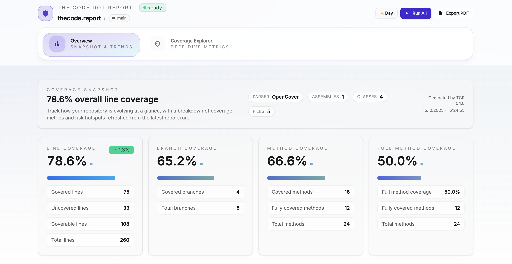

### **thecode.report**

> **thecode.report** is in its initial release and may contain unexpected bugs or incomplete features.

**thecode.report** is a lightweight, Python-based tool that automatically collects, parses, and visualizes **.NET code coverage results using coverlet**.

It spins up a **live local dashboard** (via `tcdr --serve`) where developers can instantly explore coverage data, identify testing gaps, and export pdf reports for sharing coverage summaries.



---

#### Setup

1. **Install prerequisites**

   - Make sure [Python](https://www.python.org/downloads/) is installed (3.9 or later).
   - Install [pipx](https://pypa.github.io/pipx/) for isolated tool environments:
     ```bash
     python3 -m pip install --user pipx
     python3 -m pipx ensurepath
     ```

2. **Install thecode.report**

   ```bash
   pipx install tcdr
   ```

3. **Run in your .NET project**
   In the root of your solution (where your unit test project resides):

   ```bash
   tcdr --serve
   ```

   Then open [**http://localhost:8080**](http://localhost:8080) to explore your coverage dashboard.

4. **Requirements**
   `tcdr` works with any .NET project that has [`coverlet.msbuild`](https://www.nuget.org/packages/coverlet.msbuild) installed.
   The tool automatically runs Coverlet under the hood, generates the coverage JSON file, and visualizes it in a live dashboard.

---

#### 🧠 How It Works

1. **Runs Coverlet under the hood** — `tcdr --serve` executes a standard MSBuild command using `coverlet.msbuild` to generate a JSON coverage report.
2. **Processes and enhances data** — TCDR reads the coverage output, adds its own properties, and structures it for the dashboard.
3. **Builds a Z8ter-powered app** — The processed report is moved into a `.tcdr/tcdr-app` folder as `content/dashboard.json`.
4. **Renders via Z8ter** — Z8ter serves this file as props to a React-based dashboard component.

The use of **[Z8ter](https://z8ter.dev)** is what makes this workflow unique:

- It enables **server-driven UI rendering** without needing to build a separate API.
- It provides **component-level hydration control**, allowing dynamic updates with minimal client overhead.

This approach gives thecode.report the speed of a static report generator with the fluid interactivity of a live web app.

---

#### Credits

[**ReportGenerator**](https://reportgenerator.io/) for the test project.
